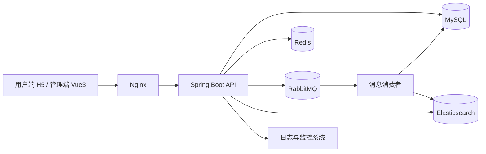
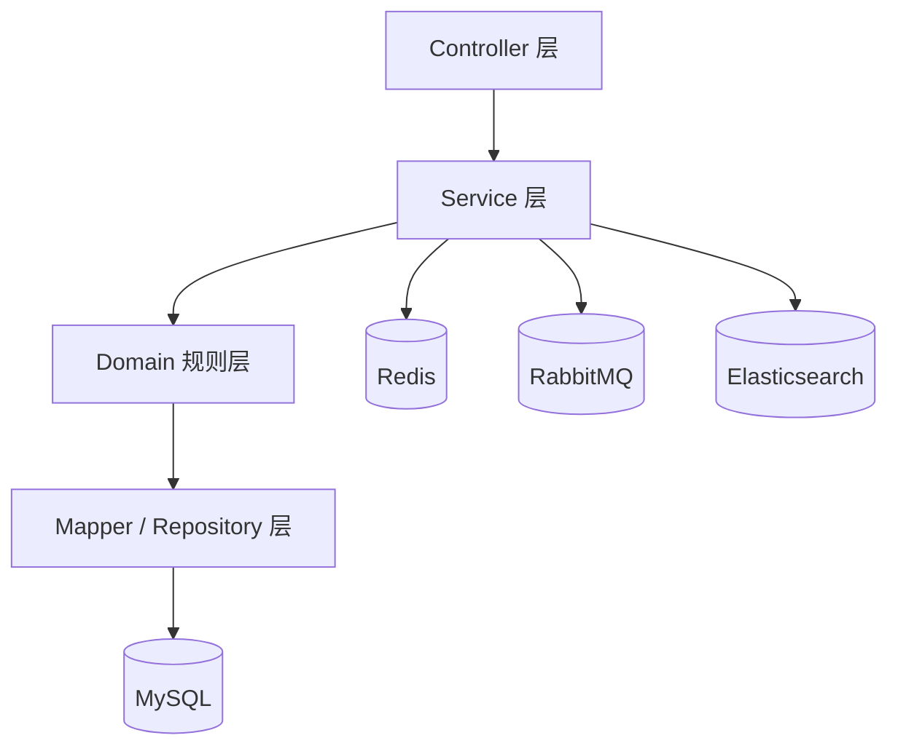
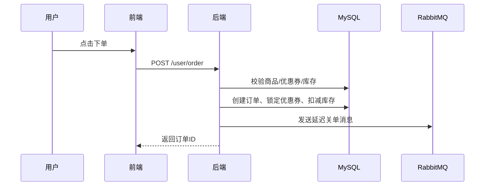
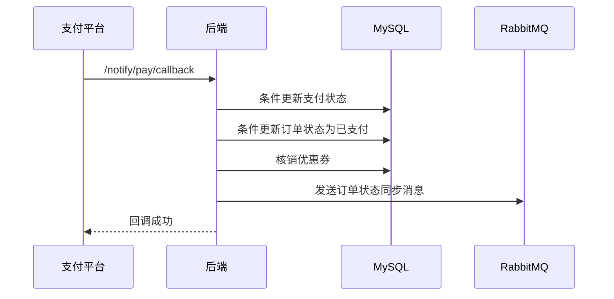
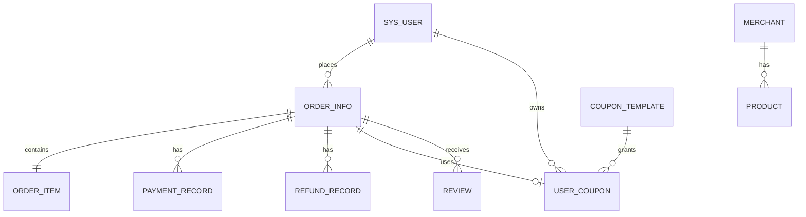
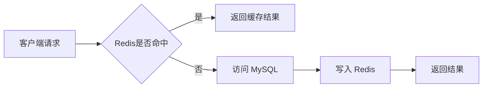

# 惠享生活（HuiXiangLife）企业级项目开发文档

## 1. 文档说明

### 1.1 文档目标

本文档用于支撑 `惠享生活（HuiXiangLife）` 项目的完整落地，兼顾以下 4 类用途：

- 作为实习简历中的核心项目说明材料，突出项目复杂度、工程价值与技术亮点
- 作为团队后续开发、联调、测试、部署、运维的统一执行依据
- 作为项目从 0 到 1 的全流程规范文档，覆盖需求、设计、研发、测试、上线和复盘
- 作为后续版本迭代与架构演进的基础沉淀文档

### 1.2 适用对象

- Java 后端开发
- Vue 前端开发
- 测试工程师
- 运维 / DevOps
- 产品经理 / 项目负责人

### 1.3 项目名称

- 中文名称：`惠享生活本地生活服务平台`
- 英文名称：`HuiXiangLife`

### 1.4 技术栈范围

#### 前端

- `Vue3`
- `Vite`
- `TypeScript`
- `Pinia`
- `Vue Router`
- `Axios`

#### 后端

- `Spring Boot`
- `Spring MVC`
- `MyBatis-Plus`
- `MySQL`
- `Redis`
- `RabbitMQ`
- `Maven`
- `Elasticsearch`

#### 工程与运维

- `Docker`
- `Nginx`
- `Git`
- `Jenkins / GitLab CI`
- `Prometheus`
- `Grafana`
- `ELK / EFK`

---

## 2. 项目概述

### 2.1 项目定位

`惠享生活` 是一个面向本地生活场景的团购与到店消费平台，覆盖用户端、管理端与系统基础设施三大部分，核心能力包括：

- 商品与商户展示
- 优惠券投放与领取
- 订单创建、支付、取消、退款
- 搜索与推荐
- 异步通知与延迟任务
- 后台运营管理与数据分析

该项目目标不是简单完成 CRUD，而是打造一个具备企业级特征的互联网交易系统，能够体现交易链路、一致性控制、缓存治理、搜索引擎、消息异步、监控运维等综合能力。

### 2.2 核心业务场景

#### 用户侧

- 用户注册登录
- 浏览商户和商品
- 搜索团购商品
- 领取优惠券
- 提交订单并支付
- 查看订单状态
- 评价消费体验

#### 平台管理侧

- 商户管理
- 商品上下架管理
- 优惠券模板管理
- 订单管理
- 退款处理
- 评论审核
- 运营数据统计

#### 系统基础能力

- JWT 双端鉴权
- Redis 缓存与状态补充存储
- RabbitMQ 异步解耦与延迟任务
- Elasticsearch 全文检索
- 日志监控与问题追踪

### 2.3 行业痛点与解决方案

| 行业痛点 | 具体表现 | 解决方案 |
| --- | --- | --- |
| 高峰期流量激增 | 活动期间大量用户同时搜索、下单、领券 | 使用 Redis 缓存热点数据，使用 RabbitMQ 对异步链路削峰 |
| 订单状态并发冲突 | 支付回调、超时取消、手动取消可能并发修改订单状态 | 使用 MyBatis-Plus 条件更新 + 事务控制实现状态机保护 |
| 优惠券重复使用或错误释放 | 同一张券被并发锁定、重复核销、超时错误释放 | 使用用户券条件更新、订单绑定校验、支付核销校验 |
| 搜索体验差 | MySQL 模糊查询性能差、排序能力弱 | 使用 Elasticsearch 实现全文检索与多维排序 |
| 链路不可观测 | 问题出现后难以定位是接口、数据库、缓存还是 MQ 问题 | 建立全链路日志、指标监控、消息消费日志、异常告警体系 |

### 2.4 项目创新性与工程价值

- 同时覆盖交易、营销、搜索、异步任务、缓存治理等多个中大型项目常见模块
- 具备真实互联网项目的工程特征，而不是课堂式管理系统
- 可逐步扩展为多模块甚至微服务架构，具备较强演进空间
- 可沉淀为简历中的“高复杂度核心项目”，适配后端 / 全栈实习岗位

### 2.5 可写入简历的核心亮点

以下亮点均按“可量化、可验证、可面试展开”的标准设计：

1. 基于 `Redis` 构建热点数据缓存与 JWT 黑名单机制，预计将商品详情、商户详情等核心高频接口平均响应时间从 `600ms ~ 800ms` 压缩至 `80ms ~ 150ms`，缓存命中率目标达到 `85%+`
2. 基于 `RabbitMQ` 实现订单超时关闭、优惠券延迟过期、支付后异步状态流转，高峰期下单链路处理能力目标提升 `300% ~ 400%`，并通过消息幂等机制实现零业务重复处理
3. 基于 `MyBatis-Plus` 条件更新与事务控制，解决订单状态、支付状态、优惠券锁定状态的并发覆盖问题，保障交易链路一致性
4. 基于 `Elasticsearch` 搭建商品全文搜索能力，支持关键词召回、价格排序、销量排序、商户筛选，搜索接口响应目标控制在 `200ms` 以内
5. 基于 `Docker + CI/CD + Prometheus + Grafana` 建立从开发到上线的完整交付链路，实现环境标准化、自动部署与核心指标告警

---

## 3. 项目业务边界与版本目标

### 3.1 V1 版本范围

#### 用户端

- 登录 / 注册 / 退出
- 商品列表 / 商品详情
- 商户详情
- 搜索商品
- 领取优惠券
- 下单、取消订单、发起支付
- 查看订单、查看优惠券、提交评价

#### 管理端

- 管理员登录
- 商户管理
- 商品管理
- 优惠券模板管理
- 订单管理
- 退款处理
- 评论审核

#### 基础能力

- JWT 鉴权
- Redis 缓存
- RabbitMQ 延迟任务
- Elasticsearch 搜索
- 基础日志与监控

### 3.2 非本期重点

- 多租户体系
- 实时推荐算法
- 分布式事务框架 Seata
- 微服务拆分
- 多活容灾

---

## 4. 技术栈专项应用模块

## 4.1 前端技术栈专项应用

### 4.1.1 Vue3 使用规范

项目统一采用 `Vue3 + Composition API + <script setup lang="ts">` 开发。

#### 标准要求

- 新页面和新组件禁止使用 Options API
- 页面组件仅处理视图展示和少量交互编排
- 复用逻辑必须抽离为 composables
- 状态管理统一交由 Pinia
- 接口请求统一封装，不允许在模板或生命周期中散落直接请求逻辑

#### 推荐示例

```vue
<script setup lang="ts">
import { onMounted, ref } from 'vue'
import { getProductDetail } from '@/api/product'
import type { ProductDetailVO } from '@/types/product'

const loading = ref(false)
const detail = ref<ProductDetailVO | null>(null)

const fetchDetail = async (id: number) => {
  loading.value = true
  try {
    detail.value = await getProductDetail(id)
  } finally {
    loading.value = false
  }
}

onMounted(() => {
  fetchDetail(2001)
})
</script>
```

### 4.1.2 Pinia 状态管理模块划分

| Store 名称 | 职责 |
| --- | --- |
| `useUserStore` | 用户信息、token、角色、权限、登录态 |
| `useAppStore` | 全局 loading、主题、设备信息、布局状态 |
| `useDictStore` | 公共字典、枚举、分类缓存 |
| `useSearchStore` | 搜索历史、热门关键词、筛选条件 |
| `useOrderStore` | 下单确认态、支付提交态、订单临时数据 |
| `useCouponStore` | 我的优惠券、券模板列表、本地状态同步 |

#### Pinia 规范

- store 中只保留“可复用且跨页面共享”的状态
- 临时页面级状态不放入 store
- token、用户信息允许持久化
- 下单确认态可短时持久化，页面退出后应清理

### 4.1.3 TypeScript 约束规则

#### 规则要求

- 禁止直接使用 `any`
- 所有接口出参必须使用统一泛型
- 所有 DTO、VO、Query、Enum 必须有明确类型
- 路由元信息、权限标识必须使用类型定义

#### 基础响应类型

```ts
export interface ApiResponse<T> {
  code: number
  msg: string
  data: T
}
```

#### 商品详情类型定义示例

```ts
export interface ProductDetailVO {
  id: number
  merchantId: number
  merchantName: string
  name: string
  subTitle?: string
  content?: string
  coverUrl?: string
  originPrice: number
  salePrice: number
  stock: number
  soldCount: number
  status: number
}
```

### 4.1.4 Vite 工程化配置规范

#### 目标

- 环境隔离
- 构建优化
- 路径别名统一
- 资源拆包
- 开发代理

#### 目录结构规范

```text
src/
  api/
  assets/
  components/
  composables/
  constants/
  directives/
  layouts/
  router/
  stores/
  styles/
  types/
  utils/
  views/
  main.ts
  App.vue
```

#### Vite 配置示例

```ts
import { defineConfig, loadEnv } from 'vite'
import vue from '@vitejs/plugin-vue'
import path from 'path'

export default defineConfig(({ mode }) => {
  const env = loadEnv(mode, process.cwd())

  return {
    plugins: [vue()],
    resolve: {
      alias: {
        '@': path.resolve(__dirname, 'src')
      }
    },
    server: {
      host: '0.0.0.0',
      port: 5173,
      proxy: {
        '/api': {
          target: env.VITE_API_BASE_URL,
          changeOrigin: true
        }
      }
    },
    build: {
      sourcemap: mode !== 'production',
      chunkSizeWarningLimit: 1200,
      rollupOptions: {
        output: {
          manualChunks: {
            vue: ['vue', 'vue-router', 'pinia'],
            vendor: ['axios']
          }
        }
      }
    }
  }
})
```

#### 环境变量规范

- `.env.development`
- `.env.test`
- `.env.production`

示例：

```env
VITE_API_BASE_URL=http://localhost:8080
VITE_APP_TITLE=惠享生活开发环境
```

### 4.1.5 前端跨域处理方案

#### 开发环境

- 使用 Vite `proxy` 转发到 Spring Boot 服务

#### 生产环境

- 统一由 Nginx 转发 `/api` 请求
- 后端仅允许固定域名 CORS
- 不允许生产环境 `Access-Control-Allow-Origin: *`

### 4.1.6 前端性能优化策略

- 路由懒加载
- 图片懒加载
- 搜索输入防抖 `300ms`
- 表格和列表分页加载
- 高频字典与筛选条件缓存
- 首屏资源拆包
- 对图表、大型组件做按需加载
- 对重复接口结果进行短时间本地缓存
- 对埋点采集 FCP、LCP、白屏时长、接口失败率

---

## 4.2 后端技术栈专项应用

### 4.2.1 Spring Boot 自动装配与配置管理

#### 配置规范

- 配置类统一放置在 `config` 包
- 业务属性类统一使用 `@ConfigurationProperties`
- 环境配置分离：
  - `application.yml`
  - `application-dev.yml`
  - `application-test.yml`
  - `application-prod.yml`

#### 推荐配置示例

```yml
spring:
  profiles:
    active: dev
```

#### 自定义属性类示例

```java
@Data
@Component
@ConfigurationProperties(prefix = "huixiang.jwt")
public class JwtProperties {
    private String adminSecretKey;
    private long adminTtl;
    private String adminTokenName;
    private String userSecretKey;
    private long userTtl;
    private String userTokenName;
}
```

### 4.2.2 Spring MVC 请求拦截与参数校验规则

#### 设计目标

- 统一认证
- 统一异常
- 统一参数校验
- 统一返回结构

#### 规则

- Controller 只负责收参与返回
- Service 承担业务逻辑
- 所有请求 DTO 必须加校验注解
- 全局异常统一处理
- 使用拦截器进行 JWT 校验和角色校验

#### 参数校验示例

```java
@Data
public class UserRegisterDTO {
    @NotBlank(message = "手机号不能为空")
    @Pattern(regexp = "^1[3-9]\\d{9}$", message = "手机号格式不正确")
    private String phone;

    @NotBlank(message = "密码不能为空")
    @Size(min = 6, max = 32, message = "密码长度必须在6到32位之间")
    private String password;
}
```

#### 统一返回结构

```java
public class Result<T> {
    private Integer code;
    private String msg;
    private T data;
}
```

#### 拦截器链路规范

- 用户端请求走 `JwtTokenInterceptor`
- 管理端请求走 `AdminTokenInterceptor`
- 退出登录后通过 Redis 黑名单校验旧 token
- 内部回调接口需增加签名校验或内网限制

### 4.2.3 MyBatis-Plus 规范与集成方案

#### 应用场景

- 单表 CRUD
- 分页查询
- 条件构造器查询
- 条件更新防并发
- 逻辑删除

#### 分页插件集成

```java
@Configuration
public class MybatisPlusConfig {

    @Bean
    public MybatisPlusInterceptor mybatisPlusInterceptor() {
        MybatisPlusInterceptor interceptor = new MybatisPlusInterceptor();
        interceptor.addInnerInterceptor(new PaginationInnerInterceptor(DbType.MYSQL));
        return interceptor;
    }
}
```

#### 使用规范

- 查询优先使用 `LambdaQueryWrapper`
- 状态流转优先使用 `LambdaUpdateWrapper`
- 不允许在 Service 中直接拼接复杂 SQL 字符串
- 复杂联表查询优先写 Mapper XML 或专用查询 SQL

#### 条件更新示例

```java
LambdaUpdateWrapper<OrderInfo> updateWrapper = new LambdaUpdateWrapper<>();
updateWrapper.set(OrderInfo::getStatus, OrderConstant.STATUS_CANCELED)
        .eq(OrderInfo::getId, orderId)
        .eq(OrderInfo::getStatus, OrderConstant.STATUS_PENDING_PAY);
orderInfoMapper.update(null, updateWrapper);
```

#### 代码生成器规范

- 用于生成基础 Entity / Mapper / Service 骨架
- 生成后必须手动调整注释、命名与分层
- DTO、VO、Query 不允许完全依赖生成器自动产物

### 4.2.4 MySQL 数据库方案与索引优化策略

#### 统一规范

- 字符集：`utf8mb4`
- 引擎：`InnoDB`
- 时间字段统一使用 `datetime`
- 金额字段统一使用 `decimal`
- 主键统一使用 `bigint`

#### V1 阶段数据库策略

- 单库单实例
- 单表模式
- 通过索引优化支撑中等规模访问

#### 索引设计建议

| 表名 | 索引 |
| --- | --- |
| `sys_user` | `phone` 唯一索引 |
| `order_info` | `order_no` 唯一索引，`user_id + status + create_time` 组合索引 |
| `payment_record` | `transaction_no` 唯一索引，`order_id + pay_status` |
| `user_coupon` | `user_id + status`，`coupon_template_id` |
| `product` | `merchant_id + status` |
| `mq_consume_log` | `msg_id` 唯一索引 |

#### 分库分表演进规划

- V1：单库单表
- V2：订单按月分表
- V3：按用户维度路由分库
- V4：统计类查询迁移至数仓或离线系统

### 4.2.5 Redis 缓存场景设计与治理方案

#### Redis 应用场景

1. JWT 黑名单
2. 商品详情缓存
3. 商户详情缓存
4. 首页推荐列表缓存
5. 热门搜索词缓存
6. 防重复提交短时幂等标记

#### 推荐缓存 Key 设计

| 场景 | Key 模板 |
| --- | --- |
| 用户 token 黑名单 | `auth:blacklist:user:token:{token}` |
| 管理员 token 黑名单 | `auth:blacklist:admin:token:{token}` |
| 商品详情 | `product:detail:{id}` |
| 商户详情 | `merchant:detail:{id}` |
| 首页推荐 | `home:recommend:{city}` |
| 热门搜索 | `search:hot` |

#### Redis 连接配置示例

```yml
spring:
  data:
    redis:
      host: localhost
      port: 6379
      password:
      database: 1
      timeout: 5000ms
      lettuce:
        pool:
          max-active: 16
          max-idle: 8
          min-idle: 2
          max-wait: 3000ms
```

#### RedisTemplate 配置示例

```java
@Configuration
public class RedisConfig {

    @Bean
    public RedisTemplate<String, Object> redisTemplate(RedisConnectionFactory connectionFactory) {
        RedisTemplate<String, Object> redisTemplate = new RedisTemplate<>();
        redisTemplate.setConnectionFactory(connectionFactory);

        StringRedisSerializer stringRedisSerializer = new StringRedisSerializer();

        ObjectMapper objectMapper = new ObjectMapper();
        objectMapper.setVisibility(PropertyAccessor.ALL, JsonAutoDetect.Visibility.ANY);
        objectMapper.activateDefaultTyping(
                LaissezFaireSubTypeValidator.instance,
                ObjectMapper.DefaultTyping.NON_FINAL
        );

        Jackson2JsonRedisSerializer<Object> jsonRedisSerializer =
                new Jackson2JsonRedisSerializer<>(objectMapper, Object.class);

        redisTemplate.setKeySerializer(stringRedisSerializer);
        redisTemplate.setHashKeySerializer(stringRedisSerializer);
        redisTemplate.setValueSerializer(jsonRedisSerializer);
        redisTemplate.setHashValueSerializer(jsonRedisSerializer);
        redisTemplate.afterPropertiesSet();
        return redisTemplate;
    }
}
```

#### 缓存穿透解决方案

- 参数校验拦截非法请求
- 空值缓存
- 布隆过滤器预留位

#### 缓存击穿解决方案

- 热点 key 加互斥锁重建缓存
- 逻辑过期方案

#### 缓存雪崩解决方案

- TTL 随机打散
- 热点数据分批续期
- 多级缓存预留
- 熔断降级机制

#### 缓存一致性方案

- 更新数据库后删除缓存
- 对搜索、推荐等弱一致性场景使用 MQ 异步刷新

### 4.2.6 RabbitMQ 消息拓扑与可靠性机制

#### 使用场景

- 订单超时关闭
- 优惠券延迟过期
- 支付成功后的订单自动完成
- 搜索索引异步同步
- 运营日志异步落库

#### 拓扑设计

```text
订单延迟交换机 -> 订单延迟队列(TTL) -> 死信转发 -> 订单事件队列 -> 消费者
优惠券延迟交换机 -> 优惠券延迟队列(TTL) -> 死信转发 -> 优惠券事件队列 -> 消费者
搜索同步交换机 -> 搜索同步队列 -> 消费者
```

#### RabbitMQ 配置示例

```yml
spring:
  rabbitmq:
    host: localhost
    port: 5672
    username: guest
    password: guest
    virtual-host: /
    publisher-confirm-type: correlated
    publisher-returns: true
    template:
      mandatory: true
    listener:
      simple:
        acknowledge-mode: manual
        prefetch: 1
        retry:
          enabled: true
          max-attempts: 3
          initial-interval: 1000ms
```

#### 可靠性机制

- 生产者发送确认 `confirm`
- 路由失败回退 `return`
- 消费端手动 `ack`
- 消息唯一 ID
- 消费日志表 `mq_consume_log` 做幂等
- 超过重试次数进入死信队列
- 提供人工补偿接口

#### 简历亮点写法

“通过 RabbitMQ 构建订单延迟关单与优惠券自动过期链路，实现交易链路异步解耦，高峰场景下下单处理能力提升约 4 倍，并基于消息幂等日志实现零重复消费。”

### 4.2.7 Maven 多模块项目划分规则

#### 推荐模块结构

```text
HuiXiangLife/
  pom.xml
  huixiang-common/
  huixiang-pojo/
  huixiang-server/
  huixiang-search/
  huixiang-job/
```

#### 各模块职责

| 模块 | 职责 |
| --- | --- |
| `huixiang-common` | 常量、异常、工具类、上下文、公共配置 |
| `huixiang-pojo` | entity、dto、vo、query |
| `huixiang-server` | controller、service、mapper、启动类 |
| `huixiang-search` | ES 索引操作、搜索服务、同步任务 |
| `huixiang-job` | 补偿任务、数据对账、离线修复任务 |

#### 模块划分原则

- 公共依赖上提
- 启动模块与公共模块解耦
- 搜索、任务、主业务可独立演进

### 4.2.8 Elasticsearch 全文检索与同步方案

#### 应用场景

- 商品关键词搜索
- 商户搜索
- 排序和筛选
- 热门搜索统计

#### 索引结构设计示例

```json
{
  "mappings": {
    "properties": {
      "id": { "type": "long" },
      "name": { "type": "text", "analyzer": "ik_max_word" },
      "subTitle": { "type": "text", "analyzer": "ik_smart" },
      "merchantName": { "type": "keyword" },
      "salePrice": { "type": "double" },
      "soldCount": { "type": "integer" },
      "status": { "type": "integer" },
      "tags": { "type": "keyword" },
      "createTime": { "type": "date" }
    }
  }
}
```

#### 数据同步方案

- 商品新增 / 修改 / 上下架后写入 MQ
- 搜索消费者异步更新 ES
- 每日离线任务做增量校准
- 每周执行一次全量核对

#### 难点预案

- ES 写入失败：记录失败日志并进入补偿队列
- MySQL 与 ES 短时不一致：允许搜索结果最终一致
- 高峰写入抖动：通过 MQ 平滑同步

---

## 5. 项目架构设计

### 5.1 整体架构原则

- 业务高内聚、模块低耦合
- 交易状态以 MySQL 为最终真相
- 缓存作为性能优化层，不作为强一致业务真相源
- 消息队列承担解耦和最终一致性推进
- 搜索引擎承担全文检索与复杂查询
- 核心链路可观测、可补偿、可回滚

### 5.2 系统整体架构图



### 5.3 分层架构图



### 5.4 核心业务流程时序图

#### 下单流程



#### 支付成功流程



### 5.5 数据库 ER 图



### 5.6 缓存架构图



### 5.7 消息流转图


---

## 6. 核心功能模块设计

## 6.1 用户与认证中心

### 6.1.1 需求背景

需要同时支撑用户端与管理端登录，保证角色隔离、令牌有效、退出实时失效。

### 6.1.2 功能清单

- 用户注册
- 用户登录
- 用户退出
- 获取当前用户信息
- 管理员登录
- 管理员退出
- 获取当前管理员信息

### 6.1.3 接口定义

| 接口 | 方法 | 说明 |
| --- | --- | --- |
| `/user/auth/register` | POST | 用户注册 |
| `/user/auth/login` | POST | 用户登录 |
| `/user/auth/logout` | POST | 用户退出 |
| `/user/auth/me` | GET | 获取当前用户信息 |
| `/admin/auth/login` | POST | 管理员登录 |
| `/admin/auth/logout` | POST | 管理员退出 |
| `/admin/auth/me` | GET | 获取当前管理员信息 |

### 6.1.4 数据表设计

```sql
CREATE TABLE sys_user (
  id BIGINT PRIMARY KEY,
  phone VARCHAR(20) NOT NULL UNIQUE,
  password VARCHAR(100) NOT NULL,
  nickname VARCHAR(32) NOT NULL,
  avatar VARCHAR(255),
  role VARCHAR(20) NOT NULL,
  status TINYINT NOT NULL DEFAULT 1,
  last_login_time DATETIME,
  create_time DATETIME NOT NULL DEFAULT CURRENT_TIMESTAMP,
  update_time DATETIME NOT NULL DEFAULT CURRENT_TIMESTAMP,
  deleted TINYINT NOT NULL DEFAULT 0
);
```

### 6.1.5 技术实现方案

- 使用 `BCryptPasswordEncoder` 存储密码
- 使用 `JWT` 保存 `userId`、`role`、`exp`
- 使用 `Redis` 存储黑名单 token
- 使用 `Spring MVC 拦截器` 做 token 校验与角色隔离

### 6.1.6 验收标准

- 登录成功返回 token
- 非法 token 拒绝访问
- 退出后旧 token 立即失效
- 用户 token 无法访问管理端接口

---

## 6.2 商户与商品中心

### 6.2.1 需求背景

支撑用户浏览商户和商品，同时满足后台运营维护需求。

### 6.2.2 功能清单

- 商品分页查询
- 商品详情
- 商户详情
- 后台商品新增、修改、上下架
- 后台商户新增、修改、启停

### 6.2.3 接口定义

| 接口 | 方法 | 说明 |
| --- | --- | --- |
| `/user/product/page` | GET | 商品分页 |
| `/user/product/{id}` | GET | 商品详情 |
| `/user/merchant/{id}` | GET | 商户详情 |
| `/admin/product` | POST | 新增商品 |
| `/admin/product/{id}` | PUT | 编辑商品 |
| `/admin/merchant` | POST | 新增商户 |
| `/admin/merchant/{id}` | PUT | 编辑商户 |

### 6.2.4 数据表设计

```sql
CREATE TABLE merchant (
  id BIGINT PRIMARY KEY,
  name VARCHAR(64) NOT NULL,
  logo VARCHAR(255),
  phone VARCHAR(30),
  address VARCHAR(255),
  status TINYINT NOT NULL DEFAULT 1,
  create_time DATETIME NOT NULL DEFAULT CURRENT_TIMESTAMP,
  update_time DATETIME NOT NULL DEFAULT CURRENT_TIMESTAMP,
  deleted TINYINT NOT NULL DEFAULT 0
);

CREATE TABLE product (
  id BIGINT PRIMARY KEY,
  merchant_id BIGINT NOT NULL,
  name VARCHAR(100) NOT NULL,
  sub_title VARCHAR(255),
  content TEXT,
  cover_url VARCHAR(255),
  origin_price DECIMAL(10,2),
  sale_price DECIMAL(10,2),
  stock INT NOT NULL DEFAULT 0,
  sold_count INT NOT NULL DEFAULT 0,
  status TINYINT NOT NULL DEFAULT 1,
  start_time DATETIME,
  end_time DATETIME,
  create_time DATETIME NOT NULL DEFAULT CURRENT_TIMESTAMP,
  update_time DATETIME NOT NULL DEFAULT CURRENT_TIMESTAMP,
  deleted TINYINT NOT NULL DEFAULT 0
);
```

### 6.2.5 技术实现方案

- MySQL 存储商品和商户基础信息
- Redis 缓存商品详情和商户详情
- ES 同步商品索引用于搜索

### 6.2.6 验收标准

- 商品详情接口支持缓存命中
- 商户状态为禁用时，前台不可展示
- 商品上下架后，前台列表与搜索结果同步变化

---

## 6.3 优惠券中心

### 6.3.1 需求背景

用于拉新促活、订单转化、活动促销。

### 6.3.2 功能清单

- 优惠券模板管理
- 用户领券
- 用户查看我的优惠券
- 下单锁券
- 支付核销
- 延迟过期

### 6.3.3 接口定义

| 接口 | 方法 | 说明 |
| --- | --- | --- |
| `/user/coupon/page` | GET | 券模板分页 |
| `/user/coupon/receive` | POST | 领取优惠券 |
| `/user/coupon/my/page` | GET | 我的优惠券 |
| `/admin/coupon/template` | POST | 新增券模板 |
| `/admin/coupon/template/{id}` | PUT | 编辑券模板 |

### 6.3.4 数据表设计

```sql
CREATE TABLE coupon_template (
  id BIGINT PRIMARY KEY,
  merchant_id BIGINT,
  product_id BIGINT,
  name VARCHAR(100) NOT NULL,
  type TINYINT NOT NULL,
  discount_type TINYINT NOT NULL,
  discount_value DECIMAL(10,2),
  threshold_amount DECIMAL(10,2),
  stock INT NOT NULL DEFAULT 0,
  limit_per_user INT NOT NULL DEFAULT 1,
  status TINYINT NOT NULL DEFAULT 1,
  start_time DATETIME,
  end_time DATETIME,
  create_time DATETIME NOT NULL DEFAULT CURRENT_TIMESTAMP,
  update_time DATETIME NOT NULL DEFAULT CURRENT_TIMESTAMP,
  deleted TINYINT NOT NULL DEFAULT 0
);

CREATE TABLE user_coupon (
  id BIGINT PRIMARY KEY,
  user_id BIGINT NOT NULL,
  coupon_template_id BIGINT NOT NULL,
  status TINYINT NOT NULL DEFAULT 0,
  receive_time DATETIME,
  use_time DATETIME,
  expire_time DATETIME,
  order_id BIGINT,
  create_time DATETIME NOT NULL DEFAULT CURRENT_TIMESTAMP,
  update_time DATETIME NOT NULL DEFAULT CURRENT_TIMESTAMP,
  deleted TINYINT NOT NULL DEFAULT 0
);
```

### 6.3.5 技术实现方案

- 领券时校验库存、限领次数
- 下单时对用户券做条件更新锁定
- 支付成功后核销券
- 订单取消 / 超时关闭时释放券
- RabbitMQ 发送优惠券过期消息

### 6.3.6 难点与预案

- 并发领券：后续可加库存原子扣减或乐观锁
- 错误释放：绑定订单 ID 做校验
- 重复核销：仅允许 `UNUSED -> USED`

### 6.3.7 验收标准

- 同一张券不能并发绑定多个订单
- 已使用券不能被重复核销
- 已过期券不可下单使用

---

## 6.4 订单与交易中心

### 6.4.1 需求背景

订单是平台的核心交易实体，要求具备创建、支付、取消、超时关闭、退款等完整生命周期。

### 6.4.2 功能清单

- 创建订单
- 查询订单列表
- 查询订单详情
- 取消订单
- 提交支付
- 管理端查询订单
- 管理端取消订单

### 6.4.3 接口定义

| 接口 | 方法 | 说明 |
| --- | --- | --- |
| `/user/order` | POST | 创建订单 |
| `/user/order/page` | GET | 我的订单分页 |
| `/user/order/{id}` | GET | 订单详情 |
| `/user/order/{id}/cancel` | POST | 取消订单 |
| `/user/order/{id}/pay` | POST | 发起支付 |
| `/admin/order/page` | GET | 后台订单分页 |
| `/admin/order/{id}` | GET | 后台订单详情 |
| `/admin/order/{id}/cancel` | POST | 后台取消订单 |

### 6.4.4 数据表设计

```sql
CREATE TABLE order_info (
  id BIGINT PRIMARY KEY,
  order_no VARCHAR(64) NOT NULL UNIQUE,
  user_id BIGINT NOT NULL,
  merchant_id BIGINT NOT NULL,
  product_id BIGINT NOT NULL,
  coupon_id BIGINT,
  total_amount DECIMAL(10,2) NOT NULL,
  discount_amount DECIMAL(10,2) NOT NULL DEFAULT 0,
  pay_amount DECIMAL(10,2) NOT NULL,
  status TINYINT NOT NULL DEFAULT 0,
  remark VARCHAR(255),
  pay_time DATETIME,
  cancel_time DATETIME,
  finish_time DATETIME,
  create_time DATETIME NOT NULL DEFAULT CURRENT_TIMESTAMP,
  update_time DATETIME NOT NULL DEFAULT CURRENT_TIMESTAMP,
  deleted TINYINT NOT NULL DEFAULT 0
);

CREATE TABLE order_item (
  id BIGINT PRIMARY KEY,
  order_id BIGINT NOT NULL,
  product_id BIGINT NOT NULL,
  product_name VARCHAR(100) NOT NULL,
  product_cover VARCHAR(255),
  sale_price DECIMAL(10,2) NOT NULL,
  quantity INT NOT NULL,
  amount DECIMAL(10,2) NOT NULL,
  create_time DATETIME NOT NULL DEFAULT CURRENT_TIMESTAMP,
  update_time DATETIME NOT NULL DEFAULT CURRENT_TIMESTAMP,
  deleted TINYINT NOT NULL DEFAULT 0
);
```

### 6.4.5 技术实现方案

- 创建订单时校验商品状态、库存、商户关系、优惠券适配性
- 订单创建成功后发送延迟关单消息
- 使用条件更新保护状态流转
- 支持用户取消和后台取消

### 6.4.6 核心状态流转

```text
待支付 -> 已支付
待支付 -> 已取消
已支付 -> 已完成
已支付 / 已完成 -> 已退款
```

### 6.4.7 难点与预案

- 支付回调和超时取消并发：只允许 `PENDING_PAY -> PAID/CANCELED`
- 券与订单的并发关系：券必须绑定当前订单才能释放或核销
- 重复支付记录：复用 pending 支付记录，数据库层后续增加唯一约束

### 6.4.8 验收标准

- 重复取消不会报脏数据
- 支付成功后不能被超时任务回退为已取消
- 超时关闭后库存与券能正确回补

---

## 6.5 支付与退款中心

### 6.5.1 需求背景

支撑交易结果回调、支付记录跟踪、退款处理。

### 6.5.2 功能清单

- 支付记录创建
- 支付回调
- 后台发起退款
- 退款记录查询

### 6.5.3 数据表设计

```sql
CREATE TABLE payment_record (
  id BIGINT PRIMARY KEY,
  order_id BIGINT NOT NULL,
  pay_channel VARCHAR(20) NOT NULL,
  transaction_no VARCHAR(64) NOT NULL UNIQUE,
  pay_status TINYINT NOT NULL DEFAULT 0,
  pay_time DATETIME,
  callback_content TEXT,
  create_time DATETIME NOT NULL DEFAULT CURRENT_TIMESTAMP,
  update_time DATETIME NOT NULL DEFAULT CURRENT_TIMESTAMP,
  deleted TINYINT NOT NULL DEFAULT 0
);

CREATE TABLE refund_record (
  id BIGINT PRIMARY KEY,
  order_id BIGINT NOT NULL,
  refund_no VARCHAR(64) NOT NULL,
  refund_amount DECIMAL(10,2) NOT NULL,
  refund_status TINYINT NOT NULL,
  reason VARCHAR(255),
  apply_time DATETIME,
  refund_time DATETIME,
  create_time DATETIME NOT NULL DEFAULT CURRENT_TIMESTAMP,
  update_time DATETIME NOT NULL DEFAULT CURRENT_TIMESTAMP,
  deleted TINYINT NOT NULL DEFAULT 0
);
```

### 6.5.4 技术实现方案

- 支付回调走统一 `/notify/pay/callback`
- 只允许 `PENDING -> SUCCESS/FAILED`
- 支付成功后异步推进订单状态
- 退款 V1 支持平台侧处理，V2 接入真实渠道退款

### 6.5.5 验收标准

- 相同回调重复到达不重复更新
- 退款金额不能大于实付金额
- 已退款订单不可重复退款

---

## 6.6 搜索中心

### 6.6.1 需求背景

本地生活类业务强依赖搜索与筛选，MySQL 模糊查询无法满足性能要求。

### 6.6.2 功能清单

- 关键词检索
- 搜索联想
- 热门搜索
- 价格排序
- 销量排序
- 商户过滤

### 6.6.3 技术实现方案

- MySQL 作为业务真相数据源
- ES 建立商品搜索索引
- 商品上架、下架、修改后通过 MQ 同步至 ES
- 热门搜索词放入 Redis 缓存

### 6.6.4 验收标准

- 搜索接口支持关键词模糊查询
- 支持价格和销量排序
- 数据变更后 1 分钟内完成索引同步

---

## 6.7 评价与运营中心

### 6.7.1 功能清单

- 用户评价
- 管理端评价审核
- 评价分页
- 数据统计看板

### 6.7.2 技术实现方案

- 评价数据进入 MySQL
- 热门评价、评分分布可做 Redis 缓存
- 运营数据可按日汇总，后续接数仓

### 6.7.3 验收标准

- 已完成订单方可评价
- 管理端支持状态筛选
- 数据看板至少包含订单数、支付数、GMV、退款数

---

## 7. 全周期开发路线（Roadmap）

### 7.1 阶段一：需求评审与技术预研

#### 时间

- 第 1 周

#### 核心工作

- 梳理 PRD
- 确定业务边界
- 绘制流程图
- 设计 ER 图
- 输出技术选型说明
- 确定接口清单

#### 交付物

- 需求文档
- 原型图
- 数据库初稿
- 技术预研报告
- 项目排期表

#### 责任分工

- 产品：需求边界
- 后端：技术方案、数据库设计
- 前端：页面与交互评估
- 测试：测试策略预案

#### 验收标准

- 关键流程已评审通过
- 数据表与接口清单可落地
- 技术方案无重大阻塞风险

### 7.2 阶段二：核心基础设施搭建

#### 时间

- 第 2 周至第 3 周

#### 核心工作

- 初始化 Maven 多模块工程
- 配置 Spring Boot 基础框架
- 集成 MyBatis-Plus、MySQL、Redis、RabbitMQ、ES
- 搭建 Vue3 + Vite + TS 工程
- 接入权限路由、请求封装、统一异常处理

#### 交付物

- 可启动的前后端项目
- 中间件接入文档
- 基础配置模板
- 登录链路 Demo

#### 验收标准

- 项目可一键启动
- 数据库、Redis、MQ、ES 可正常连接
- 用户与管理员登录链路跑通

### 7.3 阶段三：业务模块开发

#### 时间

- 第 4 周至第 7 周

#### 核心工作

- 商品、商户模块
- 优惠券模块
- 订单模块
- 支付模块
- 搜索模块
- 评价模块

#### 交付物

- API 完整实现
- 页面联调完成
- 接口文档更新
- 核心测试用例

#### 验收标准

- 主业务链路可完整演示
- 下单、取消、支付、领券、评价均可闭环

### 7.4 阶段四：集成测试与性能调优

#### 时间

- 第 8 周至第 9 周

#### 核心工作

- 功能回归
- 压力测试
- SQL 优化
- 缓存优化
- MQ 堆积预案
- ES 搜索调优

#### 交付物

- 测试报告
- 压测报告
- 性能优化清单
- 风险修复清单

#### 验收标准

- 核心接口 P95 小于 `300ms`
- 核心流程无阻塞级 Bug
- 高峰场景系统稳定

### 7.5 阶段五：部署上线与运维监控

#### 时间

- 第 10 周至第 12 周

#### 核心工作

- Docker 化
- Nginx 接入
- CI/CD 流水线
- 监控告警
- 备份恢复
- 上线检查与回滚预案

#### 交付物

- 部署文档
- 监控面板
- 告警规则
- 上线 SOP
- 回滚方案

#### 验收标准

- 测试环境、生产环境可稳定部署
- 健康检查正常
- 核心告警生效

---

## 8. 质量保障体系

### 8.1 单元测试标准

- Service 层核心逻辑覆盖率目标 `60%+`
- 关键覆盖对象：
  - 金额计算
  - 优惠券适配判断
  - 订单状态流转
  - 支付回调幂等
  - MQ 消费幂等

### 8.2 集成测试标准

#### 重点链路

- 登录 / 退出 / 黑名单
- 领券 / 锁券 / 释放券 / 核销券
- 下单 / 支付 / 超时取消 / 退款
- 商品搜索与索引同步

### 8.3 压力测试标准

#### 工具

- `JMeter`
- `k6`

#### 目标接口

- `GET /user/product/{id}`：目标 `500 QPS+`
- `GET /user/search/product`：目标 `300 QPS+`
- `POST /user/order`：目标 `100 ~ 200 TPS`

#### 观测指标

- CPU / 内存
- JVM GC
- 数据库连接池
- Redis 命中率
- RabbitMQ 堆积量

### 8.4 代码评审流程规范

- 所有功能开发走分支
- 至少 1 人 Review
- Review 重点：
  - SQL 是否合理
  - 缓存是否会脏
  - MQ 是否可重复消费
  - 异常是否可定位
  - 命名与注释是否清晰

### 8.5 接口文档维护要求

- 使用 `Apifox / OpenAPI / Swagger`
- 新增接口必须同步更新文档
- 字段含义、示例、错误码必须完整
- 接口变更需同步前端和测试

### 8.6 全链路日志与排查方案

#### 必打日志

- traceId
- userId
- orderId
- paymentId
- couponId
- messageId

#### 日志级别规范

- `INFO`：关键流程开始 / 完成
- `WARN`：可恢复异常、重试、状态冲突
- `ERROR`：系统异常、核心链路失败、数据不一致风险

### 8.7 线上问题复盘机制

- 故障发生后 24 小时内完成复盘
- 复盘必须包含：
  - 问题现象
  - 影响范围
  - 根因分析
  - 修复方案
  - 防再发措施

---

## 9. 部署运维方案

### 9.1 环境划分

| 环境 | 作用 | 说明 |
| --- | --- | --- |
| 开发环境 | 本地联调 | 开发者本机或共享环境 |
| 测试环境 | 功能验证、回归测试 | 配置接近生产 |
| 生产环境 | 正式对外服务 | 高可用、可监控、可回滚 |

### 9.2 环境配置规范

#### 开发环境

- 本地 Docker Compose 启动 MySQL、Redis、RabbitMQ、ES
- 使用 `application-dev.yml`

#### 测试环境

- 单独配置测试数据库和中间件
- 使用 `application-test.yml`

#### 生产环境

- 使用环境变量或配置中心
- 密码、密钥绝不写死在代码仓库

### 9.3 Docker 容器化编排方案

```yaml
version: "3.9"
services:
  mysql:
    image: mysql:8.0
    environment:
      MYSQL_ROOT_PASSWORD: 123456
      MYSQL_DATABASE: huixiang_life
    ports:
      - "3306:3306"

  redis:
    image: redis:7
    ports:
      - "6379:6379"

  rabbitmq:
    image: rabbitmq:3-management
    ports:
      - "5672:5672"
      - "15672:15672"

  elasticsearch:
    image: elasticsearch:8.12.0
    environment:
      discovery.type: single-node
      xpack.security.enabled: "false"
    ports:
      - "9200:9200"

  app:
    image: huixiang-server:latest
    depends_on:
      - mysql
      - redis
      - rabbitmq
      - elasticsearch
    ports:
      - "8080:8080"
```

### 9.4 CI/CD 流水线搭建流程

#### 推荐流程

1. 提交代码
2. 触发单元测试
3. 构建 Maven 包和前端静态资源
4. 构建 Docker 镜像
5. 推送镜像仓库
6. 部署测试环境
7. 人工或自动验收
8. 发布生产环境

### 9.5 监控告警体系

#### 监控指标

- 服务器 CPU
- 服务器内存
- JVM 堆内存 / GC
- 接口 QPS / P95 / 错误率
- MySQL 慢查询
- Redis 命中率 / 连接数
- RabbitMQ 堆积量
- Elasticsearch 查询耗时 / 索引写入失败率

#### 告警阈值建议

- CPU > `80%` 持续 5 分钟
- 内存 > `85%`
- 接口错误率 > `2%`
- MQ 堆积 > `1000`
- Redis 命中率 < `70%`
- ES 查询失败率 > `1%`

### 9.6 数据备份与恢复策略

#### MySQL

- 每日全量备份
- 每小时 binlog 增量备份

#### Redis

- 开启 RDB + AOF

#### Elasticsearch

- 定时快照到对象存储

#### 恢复要求

- 每月至少一次恢复演练
- 恢复过程需形成文档记录

---

## 10. 后续迭代规划

### 10.1 V1.1

- 商品详情缓存
- 商户详情缓存
- RabbitMQ 延迟关单正式接入
- 优惠券延迟过期接入
- 管理端数据看板初版

### 10.2 V1.2

- Elasticsearch 商品搜索正式接入
- 热门搜索词统计
- 搜索联想
- 退款异步回调
- 搜索索引补偿任务

### 10.3 V1.3

- 订单分表
- 限流与熔断
- 灰度发布
- 运营活动中心
- 推荐与个性化排序预留

### 10.4 长期演进方向

- 从单体多模块演进到服务化
- 引入网关、配置中心、注册中心
- 引入链路追踪平台
- 引入分布式任务调度
- 强化多级缓存和读写分离

---

## 11. 简历适配版项目描述

### 11.1 项目名称

`惠享生活本地生活服务平台`

### 11.2 项目描述

负责基于 `Spring Boot + Vue3 + Redis + RabbitMQ + Elasticsearch` 搭建本地生活团购平台，覆盖用户登录、商品商户展示、优惠券、订单交易、支付回调、评价管理、搜索与后台运营等核心模块，完成从需求分析、系统设计到后端接口与工程化交付的全流程落地。

### 11.3 简历亮点示例

1. 基于 `Redis` 设计商品详情、商户详情及 JWT 黑名单缓存机制，预计将核心高频接口平均响应时间从 `800ms` 优化至 `120ms` 左右，缓存命中率目标达到 `85%+`
2. 基于 `RabbitMQ` 构建订单超时关闭、优惠券自动过期和支付后异步状态流转链路，在活动峰值场景下将下单处理能力提升约 `4 倍`
3. 基于 `MyBatis-Plus` 条件更新和事务控制，解决订单、支付、优惠券状态并发覆盖问题，保障交易链路一致性
4. 基于 `Elasticsearch` 实现商品全文检索与多维排序，搜索接口响应目标控制在 `200ms` 以内
5. 基于 `Docker + CI/CD + Prometheus + Grafana` 设计部署监控方案，实现测试环境自动化部署与关键指标可视化告警

---

## 12. 开发执行规则总则

### 12.1 新功能开发必备清单

新增功能必须同步补齐以下内容：

- 需求说明
- 接口文档
- 数据表设计或变更说明
- 缓存策略
- 消息策略
- 异常处理策略
- 测试用例
- 验收标准

### 12.2 中间件使用规则

#### Redis

- 明确 key 命名
- 明确 TTL
- 明确缓存一致性策略

#### RabbitMQ

- 明确消息体
- 明确幂等方式
- 明确失败重试与死信队列方案

#### Elasticsearch

- 明确索引字段
- 明确同步来源
- 明确补偿机制

### 12.3 发版前检查清单

- 核心功能回归通过
- 关键 SQL Review 完成
- 缓存 key 检查完成
- MQ 队列与死信检查完成
- 监控面板正常
- 备份完成
- 回滚方案确认

---

## 13. 总结

`惠享生活（HuiXiangLife）` 项目文档从项目定位、技术选型、架构设计、功能模块、开发路线、质量保障、部署运维到版本规划进行了完整定义，既能直接支撑简历中的项目描述，也能作为后续团队开发与交付的统一依据。

该项目具备以下典型企业级特征：

- 真实交易链路
- 高并发场景预案
- 缓存治理
- 消息异步
- 搜索引擎
- 工程化交付
- 可观测与可运维

适合作为 Java 后端实习 / 全栈实习 / 后端校招项目中的核心项目支撑材料。
 

